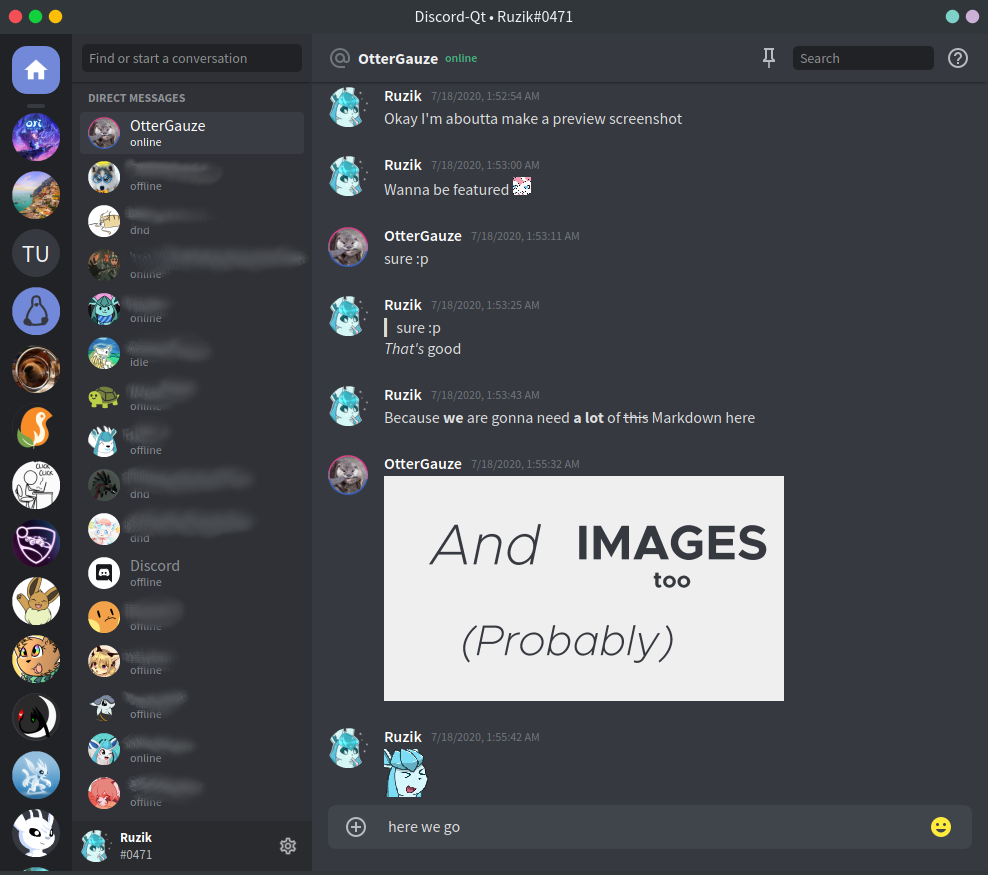

# DiscordQt
[](https://www.npmjs.com/package/discord-qt)


[](https://discord.gg/tNNuUK4)

A Discord desktop client powered by Node.JS and [NodeGui](https://github.com/nodegui).
It offers a significantly less resource-consuming experience comparing to the official Electron-based desktop client thanks to native UI rendering instead of a Chromium rendering engine.

### **[Download](https://github.com/ruslang02/discord-qt/releases/latest) for Windows, Linux and macOS**



## Installing from npm
Windows (macOS should work as well, however not tested):
```bash
npm i -g discord-qt
```

Linux:
```
# npm i -g discord-qt --unsafe-perm --allow-root
```

## Building from sources

Node.JS v12+ is required to build.

```bash
git clone https://github.com/ruslang02/discord-qt
cd discord-qt/
npm install
npm start
```

## Configuration
In order to run this application you **must** obtain a Discord user token [(how-to guide)](https://github.com/Tyrrrz/DiscordChatExporter/wiki/Obtaining-Token-and-Channel-IDs).
You can configure your user accounts, as well as other settings in the Settings screen.

## Plugins
Plugins should be located in `~/.config/discord-qt/plugins` and represent itself as an npm-like package with `discord-qt` and `plugin` keywords placed in `package.json`. Currently available plugins:
 - [mpris-dqt-plugin](https://github.com/ruslang02/mpris-dqt-plugin)

## Fonts
By default, the application uses Source Sans Pro font. However, if you want an even more seamless experience, you need to obtain a copy of Whitney fonts (commercial fonts used by Discord) and put them into `/assets/fonts` folder. In order to activate them, uncomment line with Whitley font in `/src/windows/RootWindow.scss` and rebuild.

## Notice
[Discord's Terms of Service](https://discord.com/terms) do not explictly prohibit the usage of third-party clients, however we can not guarantee that accounts using this application will not be disabled.
DiscordQt does its best to only *replicate* official client's functionality. Authors of DiscordQt discourage usage and modification of this project's source code in the ways that may violate service's Terms of Service.

## License
GPL 3.0

## Third-party
 - [NodeGui](https://github.com/nodegui/nodegui)
 - [discord.js](https://github.com/discordjs/discord.js)
 - [Qt](https://www.qt.io/)
 - [Material Design Icons](https://github.com/Templarian/MaterialDesign)
 - [markdown-it](https://github.com/markdown-it/markdown-it)
 - [Packer](https://github.com/nodegui/packer)
 - [Source Sans Pro fonts](https://github.com/adobe-fonts/source-sans-pro)
